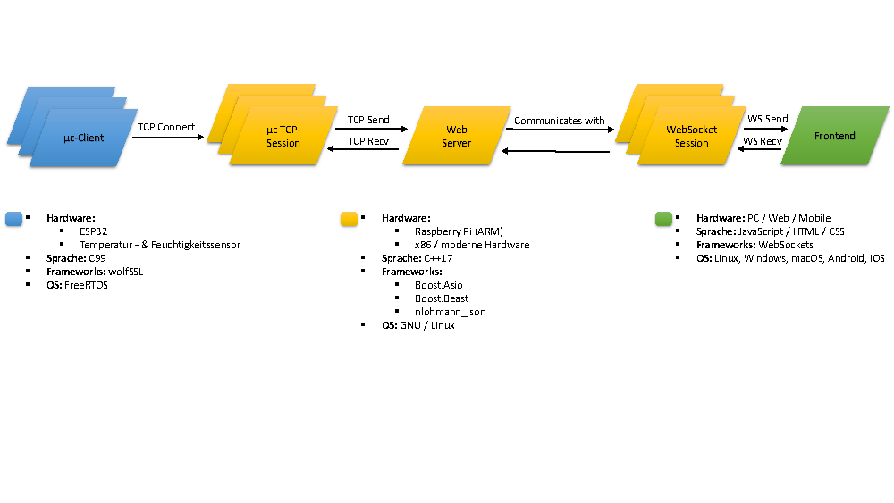

# Webserver Einleitung

Im folgenden wird die gesamte Projektstruktur der Implementierung des Servers für die Wetterstation in der englischen Sprache dokumentiert. Die Einleitung und Anleitung für das Bauen und Installieren des Servers erfolgt jedoch in deutsch. Dieses Projekt ist im Rahmen des "Teamprojekt" Moduls entstanden.

Es handelt sich hierbei um einen vollständigen asynchronen, multi-thread fähigen Webserver, welcher in C++17 mit dem Boost Framework geschrieben wurde. Das vollständige Projekt befindet sich open-source mit der MIT Lizenz unter folgendem[Github Repository](https://github.com/3n16m4/websocket-server).

Weiterhin verfügt der Server über folgende Features:

- HTTP(s) für Website
- TCP (SSL) für µc Verbindungen
- WebSocket (SSL) für Frontend Verbindungen
- SSL Zertifikat über letsencrypt
- Docker support
- Cross-Platform

## Unterstützte Platformen
- Windows x64 / x86 / ARM
- GNU / Linux x64 / x86 / ARM
- macOS x64

## Kompilierung
### Voraussetzungen
- CMake
- ninja (Optional, für schnellere Kompilierung)
- LLVM CLang, GNU/GCC Compiler oder MSVC mit C++17 support.
- boost-beast
- nlohmann_json
- fmtlib
- magic_enum

> **Tipp:** Es wird empfohlen eine neue Distro wie "Arch Linux" oder "Fedora" zu nutzen, für das Beziehen der Tools.

Generell gibt es zwei Möglichkeiten das Projekt zu bauen:

**1. Über Docker**

**2. Nativ ohne Docker**

### (1.) Kompilierung mit Docker (Empfohlen)
Der einfachste Weg den Webserver aufzusetzen, ist es über das mitgelieferte Dockerfile ein Dockerimage zu erzeugen und dieses zu starten. Dieser Schritt ist bereits mit dem Skript run.bat (für Windows) und run.sh (für UNIX, sprich GNU / Linux & macOS) automatisiert.

*GNU / Linux und macOS*

```
> ./run.sh
```

*Windows*

```
> run.bat
```

### (2.) Kompilierung der Abhängigkeiten (Ohne Docker)
Klonen der[vcpkg repo](https://github.com/microsoft/vcpkg)
```
> git clone https://github.com/Microsoft/vcpkg.git
> cd vcpkg
```
*GNU / Linux*
```
LINUX> ./bootstrap-vcpkg.sh
LINUX> ./vcpkg integrate install
LINUX> echo >> "export PATH=/${HOME}/src/vcpkg/:$PATH" ~/.bashrc
LINUX> echo >> "export VCPKG_ROOT=/$HOME/src/vcpkg" ~/.bashrc
LINUX> cd <websocket-server>
LINUX> vcpkg --triplet x64-linux install @response_file.txt --clean-after-build
```

*macOS*
```
UNIX> ./bootstrap-vcpkg.sh
UNIX> ./vcpkg integrate install
UNIX> echo >> "export PATH=/${HOME}/src/vcpkg/:$PATH" ~/.zshrc
UNIX> echo >> "export VCPKG_ROOT=/$HOME/src/vcpkg" ~/.zshrc
UNIX> cd <websocket-server>
UNIX> vcpkg --triplet x64-osx install @response_file.txt --clean-after-build
```
*Windows*
```
PS> .\bootstrap-vcpkg.bat
PS> .\vcpkg integrate install
PS> $env:Path += ";C:\Users\YourUserName\src\vcpkg"
PS> cd <websocket-server>
PS> vcpkg --triplet x64-windows install @response_file.txt --clean-after-build
```

### Installieren der Abhängigkeiten
*GNU / Linux (Arch Linux)*
```
sudo pacman -S git cmake ninja base-devel clang boost-libs
```

*Windows*

Es wird lediglich eine frische Installation von[Visual Studio](https://visualstudio.microsoft.com/vs/) für das Kompilieren benötigt.

cmake, ninja und git werden mit der Visual Studio Version 2019 und höher bereits mitgeliefert.

## Übersicht der Architektur


> **Für eine bessere Auflösung: Siehe "Architektur.pdf".**

## Autoren der verwendeten Bibliotheken
- Boost.Asio (https://github.com/chriskohlhoff/asio, Christopher M. Kohlhoff)
- Boost.Beast (https://github.com/boostorg/beast, Vinnie Falco)
- nlohmann_json (https://github.com/nlohmann/json, Niels Lohmann)
- fmtlib (https://github.com/fmtlib/fmt, Victor Zverovich)
- magic_enum (https://github.com/Neargye/magic_enum, Daniil Goncharov)
